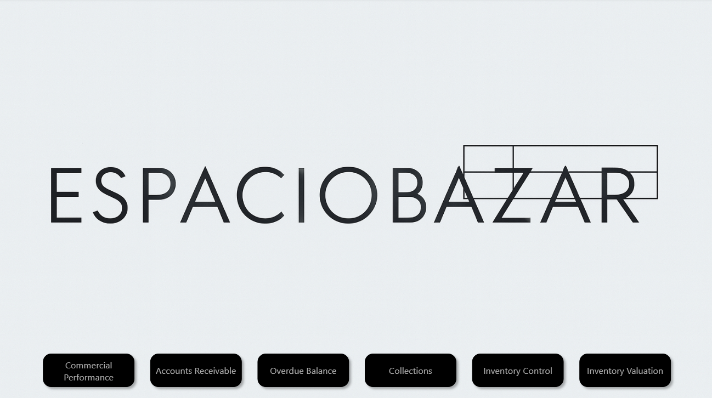
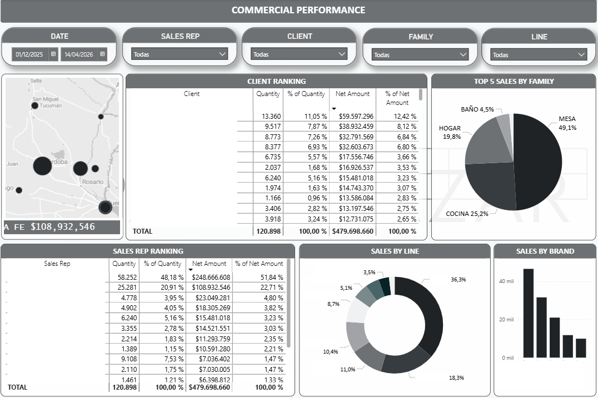
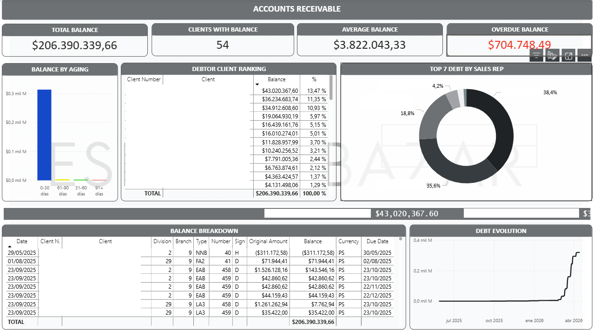
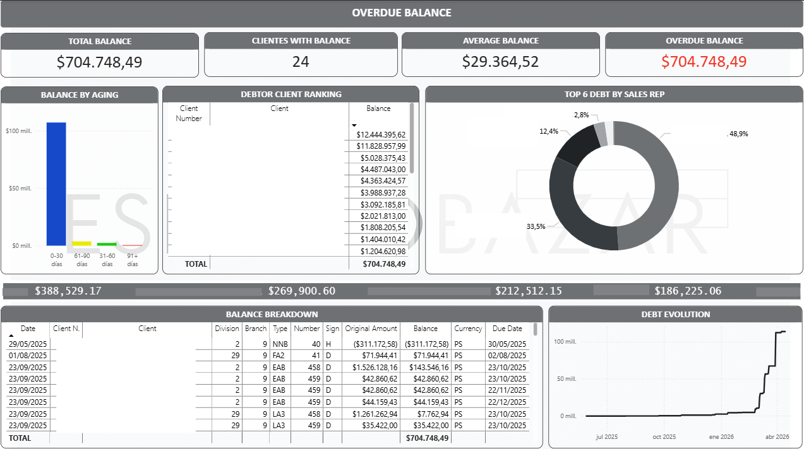
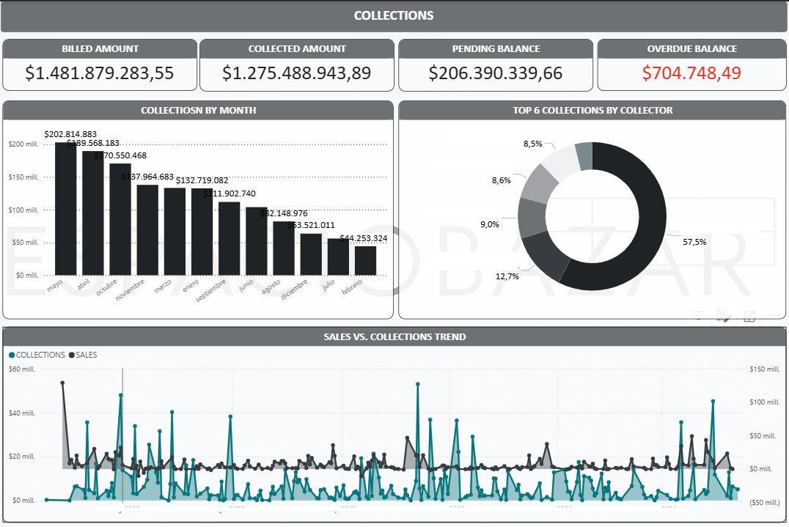
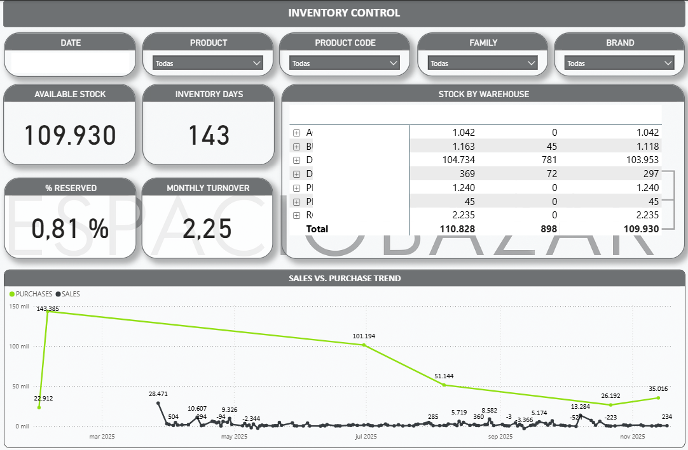
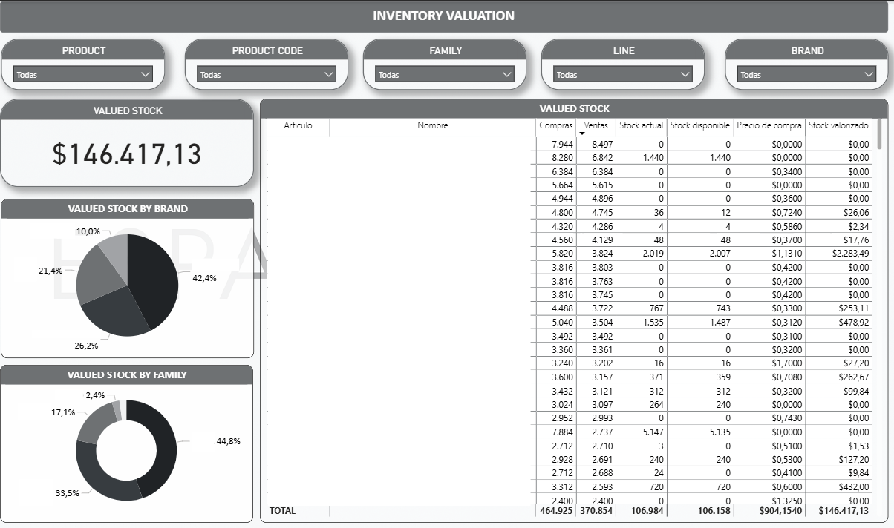

# Business Performance Dashboard (Power BI)
### Financial & Inventory Analysis · Espacio Bazar
 


 
> Interactive Power BI dashboard that consolidates billing, collections, customer debt aging, inventory, and stock valuation into a single analytical model. Built on a star schema with 13 fact and dimension tables, powering data-driven decisions for commercial, financial, and operations teams.
 
> **Disclaimer:** All datasets, table names, business identifiers, and sensitive information have been fully anonymized to preserve confidentiality and comply with corporate data protection policies. This repository is for demonstration purposes only.
 
---
 
## Dashboard Preview
 
Selected screenshots from the interactive Power BI dashboard. All data has been anonymized for confidentiality.
 
### Cover

 
### Commercial Performance

 
### Accounts Receivable

 
### Overdue Balance

 
### Collections

 
### Inventory Control

 
### Inventory Valuation

 
---
 
## Key Findings
 
Selected insights extracted from the integrated financial and inventory model:
 
### Commercial Performance
- **Strong category concentration:** Mesa (49.1%) and Cocina (25.2%) together represent **74.3% of revenue**, defining the strategic core of the business. Hogar (19.8%) is a relevant secondary contributor.
- **Critical key-person risk in sales:** the top sales representative alone generates **51.8% of revenue**, and the top 2 sales reps combined reach **~74.5%** — a structural dependency that justifies succession planning and territory rebalancing.
### Accounts Receivable
- **Healthy aging profile:** the vast majority of the $206M total balance sits in the **0–30 days bucket**, meaning the portfolio is current rather than delinquent. Truly overdue balance is only **$705K (0.34%)** of total receivables.
- **Debt concentration:** the top 5 debtors account for **~47% of total receivables**, and the top 2 sales reps concentrate **~74% of outstanding debt** — enabling focused collection actions coordinated by sales rep.
- **Recent debt acceleration:** outstanding balance grew sharply between January and April 2026, a trend that warrants a credit-policy review before it materializes as overdue.
### Collections
- **Collection rate of 86.1%** ($1.27B collected out of $1.48B billed) — strong cash conversion, with a clear opportunity to push toward the 90%+ benchmark.
- **Marked seasonality in cash inflows:** monthly collections peak in May ($203M) and bottom out in February ($44M), a ~4.6× swing that must be anticipated in working-capital planning.
- **Operational concentration:** a single collector handles **57.5% of all collections** — efficient but exposes the business to continuity risk in case of absence.
### Inventory Control
- **Inventory days of 143 (turnover 2.25× annual):** stock represents approximately 5 months of sales, well above the 30–60 day reference for retail — material overstock and working-capital tied up.
- **Procurement vs sales mismatch:** purchase spikes of 143K and 101K units far exceed monthly sales (typically under 10K units), revealing a clear opportunity to refine procurement planning based on actual demand.
- **Single-warehouse concentration:** ~95% of available stock sits in one warehouse — efficient logistically but a single point of failure for fulfillment.
### Inventory Valuation
- **Strong Pareto pattern:** the top 3 brands concentrate **90% of valued stock** and the top 3 families account for **~95%** — justifying a tiered A/B/C inventory management policy.
- **Data quality opportunity:** multiple SKUs show purchase price = $0, indicating either discontinued items in master data or missing cost information that affects valuation accuracy. A data-quality remediation effort is recommended.
> *All client, salesperson and brand identifiers have been anonymized. Aggregated percentages and absolute figures are preserved for demonstration purposes.*
 
---
 
## Business Problem & Objective
 
Finance and operations teams require consolidated, reliable visibility over business performance across multiple areas to:
- Monitor billing and collections in a unified view
- Track customer debt aging and outstanding balances
- Control current stock levels and projected inventory
- Evaluate valued stock for financial reporting
- Support operational and strategic decision-making
This dashboard centralizes transactional data from multiple business areas into a single analytical model, providing a flexible interactive tool that allows business users to explore performance indicators, detect risks, and make data-driven decisions.
 
---
 
## Architecture & Tech Stack
 
The analytical workflow follows a standard BI pipeline:
 
```
SQL Server → Power Query (ETL) → Power BI Semantic Model → Dashboard
```
 
| Layer | Technology | Purpose |
|---|---|---|
| Source | **SQL Server** | Transactional data extraction (billing, collections, debt, inventory) |
| Transformation | **Power Query (M)** | Data cleansing, shaping and ETL layer |
| Modeling | **DAX** | Calculated measures and business logic |
| Visualization | **Power BI** | Interactive dashboards and KPI monitoring |
| Version Control | **GitHub** | Code, documentation and project history |
 
---
 
## Data Model
 
The semantic model is built on a **star schema** structure connecting fact and dimension tables across the main business areas. Fact tables capture transactional events (sales, collections, stock movements) while dimension tables provide the analytical context (calendar, products, business units, geography). This design ensures consistent aggregations across multiple business areas and supports time intelligence calculations (MTD, YTD, rolling periods).
 
### Main Model Tables
 
| Table | Type | Description |
|---|---|---|
| Fact_Sales | Fact | Sales transactions by date, customer, and product |
| Fact_Collections | Fact | Payments received and collector tracking |
| Fact_Invoices | Fact | Invoice status, due dates, and financial aging |
| Fact_StockMovements | Fact | Inbound and outbound stock movements |
| Fact_Stock | Fact | Current stock levels by product and warehouse |
| Fact_StockValuation | Fact | Stock valued at cost and sale price |
| Fact_Purchases | Fact | Purchase orders and delivery tracking |
| Fact_Deliveries | Fact | Units delivered and conversion factors |
| Dim_Calendar | Dimension | Date table for time intelligence |
| Dim_Product | Dimension | Item master with family and category |
| Dim_BusinessUnit | Dimension | Business unit and item type classification |
| Dim_Province | Dimension | Geographic dimension with country and province |
| Dim_Region | Dimension | Regional grouping by province |
 
---
 
## Implementation
 
### Dataset Preparation
Data was extracted from transactional databases hosted in SQL Server, covering billing, collections, debt, and inventory tables. SQL scripts build the base datasets used as data sources in Power BI; Power Query then applies transformations, cleanses data, and shapes tables for the analytical model.
 
- SQL extraction scripts → [`sql/`](sql/)
- Power Query transformations → [`powerquery/`](powerquery/)
### DAX Measures & Business Logic
DAX measures implement key performance indicators across financial and inventory areas:
- Billing totals and period-over-period variances
- Collection rate and outstanding balance tracking
- Customer debt aging and overdue concentration
- Stock coverage and projected inventory calculations
- Stock valuation at cost and sale price
- Time intelligence calculations (MTD, YTD, rolling periods)
DAX measures → [`dax/`](dax/)
 
---
 
## Repository Structure
 
```
business-performance-dashboard/
├── sql/                    # SQL scripts for data extraction
├── powerquery/             # Power Query transformation scripts (M)
├── dax/                    # DAX measures and business logic
├── data_model/             # Data model diagram and documentation
├── dashboard/
│   └── screenshots/        # Dashboard screenshots (anonymized)
│       ├── 01_cover.png
│       ├── 02_commercial_performance.png
│       ├── 03_accounts_receivable.png
│       ├── 04_overdue_balance.png
│       ├── 05_collections.png
│       ├── 06_inventory_control.png
│       └── 07_inventory_valuation.png
├── docs/
│   └── data_dictionary.md  # Table and field descriptions
└── README.md
```
 
---
 
## Roadmap (Optional Improvements)
 
- Add incremental refresh for large historical datasets
- Implement Row-Level Security (RLS) for role-based access
- Extend the model with profitability and margin analysis
- Integrate automated refresh flows and monitoring
- Add what-if parameters for stock projection scenarios
